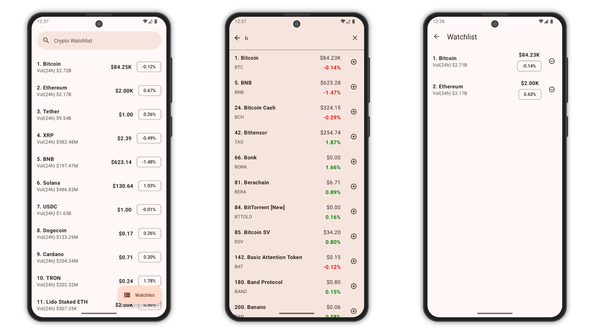

# Crypto Watchlist

Crypto Watchlist is a Kotlin-based mobile application that allows users to search for and track
their favorite cryptocurrencies. The app fetches real-time cryptocurrency data using the CoinCap API
and enables users to save selected cryptos to a locally stored watchlist.

## **Screenshots**

<picture>
  <source media="(prefers-color-scheme: dark)" srcset="screenshots/screenshot-dark.png">
  <source media="(prefers-color-scheme: light)" srcset="screenshots/screenshot.png">
  
</picture>

## Features

### Cryptocurrency Search

- Search for cryptocurrencies by name or symbol.
- Fetch and display real-time cryptocurrency prices using the [CoinCap API](https://coincap.io/).

### Watchlist Management

- Users can add cryptocurrencies to their personal watchlist.
- Store watchlist data locally using Room Database.
- Remove cryptocurrencies from the watchlist with a simple delete option.

### Data Management

- Persist watchlist data across app sessions.
- Fetch the latest prices for watchlisted cryptocurrencies when the app is opened.

## Architecture & Tech Stack

- **MVVM (Model-View-ViewModel) Architecture**
- **Retrofit** for API calls
- **Room Database** for offline storage
- **LiveData** or **Flow** for real-time UI updates
- **RecyclerView** for displaying lists
- **Material Design Components** for a user-friendly interface
- **Paging3** for efficient data pagination

## Installation & Setup

1. **Clone the repository**
   ```sh
   git clone https://github.com/yourusername/CryptoWatchlist.git
   cd CryptoWatchlist
   ```
2. **Configure API Key**
    - Add the following line to `local.properties`:
      ```properties
      COIN_CAP_API_KEY=your_api_key_here
      ```
3. **Create a Keystore for Signing**
    - Navigate to the `app` directory and create a keystore file (`your-keystore.jks`).
    - This file is required for signing the application.
4. **Set up the Keystore Properties**
    - Create a `keystore.properties` file in the project's root directory and add the following
      values:
      ```properties
      storePassword=your-store-password
      keyPassword=your-key-password
      keyAlias=your-key-alias
      storeFile=app/your-keystore.jks
      ```
    - Ensure that the file is referenced correctly in `build.gradle` to fetch the keystore details.
5. **Open in Android Studio**
6. **Sync Gradle and build the project**
7. **Run the application on an emulator or a physical device**

## API Reference

The app fetches cryptocurrency data from:

```
https://api.coincap.io/v2/assets
```

## Known Limitations

- The app currently does not support push notifications for price alerts.
- Price updates occur only when the user opens the app.

## Contribution Guidelines

1. Fork the repository
2. Create a new branch (`feature-branch-name`)
3. Commit your changes with meaningful messages
4. Push to GitHub and create a pull request

## Contact

For any queries or contributions, reach out
at [mubashirpa2002@gmail.com](mailto:mubashirpa2002@gmail.com)

## License

```
Copyright 2022 The Android Open Source Project

Licensed under the Apache License, Version 2.0 (the "License");
you may not use this file except in compliance with the License.
You may obtain a copy of the License at

    https://www.apache.org/licenses/LICENSE-2.0

Unless required by applicable law or agreed to in writing, software
distributed under the License is distributed on an "AS IS" BASIS,
WITHOUT WARRANTIES OR CONDITIONS OF ANY KIND, either express or implied.
See the License for the specific language governing permissions and
limitations under the License.
```
